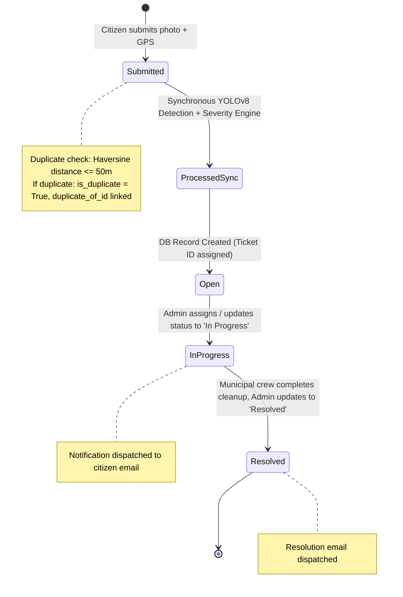
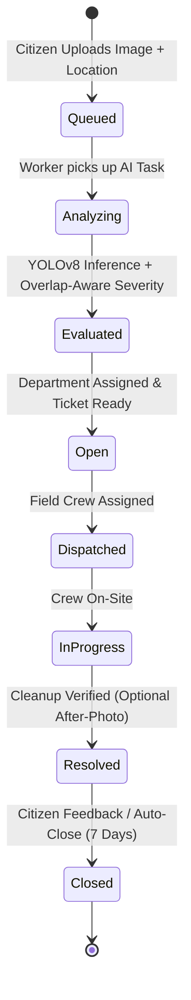

# EcoClean Civic — Architecture Upgrade Plan

**Document Version:** 1.0.0  
**Date:** October 2026  
**Status:** Architecture Audit & Evolution Blueprint  
**System:** EcoClean Civic — Smart Waste Reporting & Municipal Management Platform  

---

## 1. Current Architecture

EcoClean Civic is a monolithic full-stack civic technology application designed for citizen reporting of municipal waste and infrastructure issues, AI-driven severity evaluation, department routing, duplicate detection, and municipal dispatch management.

### Component Overview
```
┌─────────────────────────────────────────────────────────────┐
│                 Client Browser (HTML5/CSS3/ES6)             │
│  - Leaflet Map (OpenStreetMap)                              │
│  - Chart.js Operations Analytics                            │
│  - Responsive View (Dark/Light Modes, Citizen & Admin Views)│
└──────────────────────────────┬──────────────────────────────┘
                               │ REST HTTP / JSON & Multipart
                               ▼
┌─────────────────────────────────────────────────────────────┐
│                 Flask Application (Python 3.10)             │
│  ┌─────────────────┬──────────────────┬──────────────────┐  │
│  │  auth_bp        │  complaints_bp   │  analytics_bp    │  │
│  │  (/api/auth)    │  (/api/complaints│  (/api/analytics)│  │
│  └─────────────────┴──────────────────┴──────────────────┘  │
│  ┌───────────────────────────────────────────────────────┐  │
│  │ Core Engines:                                         │  │
│  │ - WasteDetector (YOLOv8s / Synthetic Mock)            │  │
│  │ - Rule-Based Severity Engine                          │  │
│  │ - Department Routing Engine                           │  │
│  │ - Haversine Duplicate Detector (50m radius)           │  │
│  │ - Multi-Backend Notification Dispatcher (Log/SMTP/SG) │  │
│  └───────────────────────────────────────────────────────┘  │
└──────────────────────────────┬──────────────────────────────┘
                               │ SQLAlchemy ORM
                               ▼
┌─────────────────────────────────────────────────────────────┐
│                 Database Layer                              │
│  - SQLite (Local Dev / Test In-Memory)                      │
│  - PostgreSQL 15 (Docker Production Deployment)             │
│  - Uploads Folder (Disk storage for raw & annotated images) │
└─────────────────────────────────────────────────────────────┘
```

- **Frontend:** Vanilla HTML5, modern CSS3 with custom properties and theme toggling (dark/light), and Vanilla JavaScript (`app.js`). External client libraries include Leaflet 1.9.4 for maps and Chart.js 4.4.0 for operational charts.
- **Backend:** Flask web server with Blueprint-based routing (`auth`, `complaints`, `analytics`), Flask-Limiter for rate-limiting, and Flask-SQLAlchemy for database abstraction.
- **AI / Computer Vision:** `WasteDetector` using Ultralytics YOLOv8s with fallback synthetic generator, plus optional secondary pothole detection model.
- **Persistence:** SQLite (`waste_management.db`) in development; PostgreSQL 15 in containerized deployment. Uploaded images and annotated visual evidence are stored on local filesystem (`backend/uploads`).
- **Containerization:** `docker-compose.yml` with `web` service (Gunicorn multi-worker) and `db` service (PostgreSQL 15 Alpine).

---

## 2. Current Citizen User Journey

1. **Discovery & Onboarding:**
   - Citizen visits `/` and sees the landing screen with an introduction and CTA: `"Report an Issue"`.
   - Citizen can use the platform as a Guest or register/log in via a modal dialog with username and password.
2. **Waste Photo Capture & Upload:**
   - Citizen drags and drops or browses an image of street litter or illegal dumping.
   - Client validates file format and previews the image instantly.
3. **Location Pinning & Address Resolution:**
   - Citizen locates the incident on an interactive Leaflet map.
   - Options include: clicking the map, dragging the pin, typing an address (geocoded via Nominatim OpenStreetMap), or clicking `"Detect My Location"` (HTML5 Geolocation).
   - Citizen can add an optional landmark note (e.g., "Near Metro Pillar 142").
4. **Submission & Synchronous AI Review:**
   - Citizen clicks `"Submit Complaint to Municipal Team"`.
   - The client sends a `multipart/form-data` POST to `/api/complaints/upload`.
   - The user interface enters a blocking loading state (`"Analyzing Image & Submitting..."`).
   - The backend runs YOLO detection synchronously, runs duplicate checking, computes severity, assigns the department, and saves records.
5. **Feedback & Result Display:**
   - Citizen receives an instant confirmation card showing:
     - Ticket ID (8-character UUID prefix).
     - Assigned municipal department.
     - Detected items and bounding-box annotated preview.
     - Severity badge (`Low`, `Medium`, `High`) and item count.
     - Duplicate warning notice if an active complaint exists within 50 meters.
6. **Tracking & Status:**
   - Citizen switches to `"Track Issues"` tab to view complaints in cards or map view.
   - Logged-in citizens can filter by `"Show My Reports Only"`.
   - Clicking `"Inspect Details"` opens a modal displaying the original vs. annotated image and ticket metadata.

---

## 3. Current Admin User Journey

1. **Authentication & Access Gate:**
   - Admin navigates to the `"Admin Portal"` tab.
   - If not authenticated as an admin, an overlay prompt requires signing in with municipal admin credentials (`admin@civic.gov`).
   - Session RBAC checks ensure non-admin users cannot view municipal analytics.
2. **Operational Overview:**
   - Admin views real-time metric cards: Total Complaints, Pending/Open, Resolved, and High Severity Alerts.
   - Interactive charts display the severity distribution (doughnut) and department workload (bar chart).
   - Incident geographic distribution map displays colored circle markers according to incident severity.
3. **Ticket Review & Inspection:**
   - Admin browses the municipal ticket table with filtering by department.
   - Admin clicks `"Inspect"` on any ticket to open the full inspection modal with bounding boxes, confidence scores, classified classes, and map pin.
4. **Status Dispatch & Citizen Notification:**
   - Admin changes the status directly in the table dropdown (`Open` → `In Progress` → `Resolved`).
   - Updating the status triggers a `PATCH /api/complaints/<ticket_id>/status`.
   - The backend synchronously invokes the notification engine (`notify_citizen`) which delivers an email via SMTP or SendGrid (or logs to console if unconfigured).

---

## 4. Current Complaint Lifecycle



---

## 5. Existing API Endpoints

| Method | Endpoint | Auth / Role | Description |
|---|---|---|---|
| `POST` | `/api/auth/register` | Public | Register citizen account (`username`, `email`, `password`) |
| `POST` | `/api/auth/login` | Public | Login with credentials (`identifier`, `password`, optional `role`) |
| `POST` | `/api/auth/logout` | Session | Clears session cookie |
| `GET` | `/api/auth/me` | Public/Session | Returns current authenticated user profile or `{ user: null }` |
| `POST` | `/api/complaints/upload` | Public / Rate-limited (10/hr) | Upload photo + coordinates; runs AI synchronously; creates complaint |
| `POST` | `/api/complaints/check-duplicate`| Public / Rate-limited (30/min) | Checks if open complaint exists within 50m of given lat/lng |
| `GET` | `/api/complaints` | Public / Session | Filter complaints by `status`, `department`, `severity`, `my_complaints` |
| `GET` | `/api/complaints/<ticket_id>` | Public | Fetch detailed complaint record with detection items |
| `PATCH`| `/api/complaints/<ticket_id>/status`| Admin Required | Update ticket status (`Open`, `In Progress`, `Resolved`); triggers notification |
| `GET` | `/api/analytics/summary` | Admin Required | KPI metrics, severity distribution, status count, department count |
| `GET` | `/api/analytics/geo` | Admin Required | GeoJSON-like point list for mapping all active complaints |
| `GET` | `/uploads/<filename>` | Public | Serve uploaded raw and annotated images |

---

## 6. Existing Database Models

### `users` Table
- `id` (Integer, Primary Key, autoincrement)
- `username` (String(80), Unique, Not Null)
- `email` (String(120), Unique, Not Null)
- `password_hash` (String(256), Not Null)
- `role` (String(20), Not Null, default `"citizen"`)
- `created_at` (DateTime, UTC)

### `complaints` Table
- `id` (String(8), Primary Key, UUID-prefix)
- `user_id` (Integer, ForeignKey `users.id`, Nullable for guest submissions)
- `created_at` (DateTime, UTC)
- `image_path` (String(255))
- `address` (Text, Nullable)
- `latitude` (Float, Nullable)
- `longitude` (Float, Nullable)
- `severity_level` (String(10): `"Low"`, `"Medium"`, `"High"`)
- `coverage_ratio` (Float: 0.0 - 1.0)
- `item_count` (Integer)
- `department` (String(64))
- `status` (String(20), default `"Open"`)
- `is_duplicate` (Boolean, default `False`)
- `duplicate_of_id` (String(8), Nullable)

### `detection_items` Table
- `id` (Integer, Primary Key, autoincrement)
- `complaint_id` (String(8), ForeignKey `complaints.id`, Cascade Delete)
- `cls` (String(50))
- `confidence` (Float)
- `x1`, `y1`, `x2`, `y2` (Float, bounding-box pixel coordinates)

---

## 7. Existing AI Pipeline

1. **Initialization:**
   - Evaluates `WASTE_MODEL_WEIGHTS` from environment or standard search paths (`best.pt`, `backend/best.pt`, `models/best.pt`).
   - If model path exists and `ultralytics` is installed, enters `real` mode; otherwise enters `mock` mode.
2. **Inference Execution:**
   - In `real` mode, runs YOLO model on image (`conf=0.15`).
   - If auxiliary pothole model exists, runs pothole detection (`conf=0.30`).
   - Annotates bounding boxes onto image via Pillow (`annotated_<filename>`).
   - In `mock` mode, generates 1 to 6 random synthetic bounding boxes scaled to image dimensions and draws mock green boxes.
3. **Severity Assessment:**
   - Sums bounding-box areas: `sum(box_area) / total_image_area`.
   - Thresholds: Low (<10% coverage and <=3 items), Medium (<30% coverage and <=7 items), High (>=30% coverage or >7 items).
4. **Department Routing:**
   - Finds the dominant detected class by frequency count.
   - Looks up `DEPARTMENT_MAP`:
     - Plastic/Paper/Cardboard/Glass/Metal -> `Recycling Department`
     - Organic/Litter/Trash/Shoes/Clothes -> `Sanitation Department`
     - Hazardous/Battery -> `Health & Hazmat Department`
     - Construction Debris/Pothole/Road Damage -> `Public Works Department`

---

## 8. Existing Frontend Pages and Components

- **Header & Navigation:** Sticky top header with brand logo, theme switcher (`Light`/`Dark`), navigation tabs (`Report Waste`, `Track Issues`, `Admin Portal`), and User Auth bar (`Sign In / Register` or `Logged in as ... / Logout`).
- **Landing Hero Banner:** Visual intro banner with CTA to scroll directly to report form.
- **Tab 1: Report Waste Form:**
  - File Dropzone with drag-and-drop and image preview.
  - Interactive Leaflet Map with draggable marker, address autocomplete search bar, and `"Detect My Location"`.
  - Dynamic result card displaying submission outcome and AI preview.
- **Tab 2: Issue Tracker:**
  - View toggle: Cards Grid vs. Full Interactive Incident Map.
  - Filter toolbar: Status, Department, Severity, and "Show My Reports Only".
- **Tab 3: Admin Command Center:**
  - Locked state overlay for unauthorized visitors.
  - KPI Stat Cards (Total, Pending, Resolved, High Severity).
  - Chart.js visualizations for severity breakdown and department workloads.
  - Interactive incident distribution map.
  - Tabular ticket manager with inline status update dropdowns and inspection buttons.
- **Modals:**
  - Authentication Modal (Dual Citizen / Admin login and registration forms + quick demo accounts).
  - Complaint Detail Inspection Modal (Side-by-side visual toggle between annotated bounding boxes and raw photo, classified waste badges with confidence percentages, dispatch details, and embedded mini-map).
- **Toast Notifications:** Dynamic slide-in notifications for success, warnings, and errors.

---

## 9. Problems and Limitations

1. **Silent Fallback & Ambiguity in AI Mode:**
   - The system did not explicitly record whether a ticket was processed via real YOLOv8 or synthetic mock generation.
   - Frontend displayed `"YOLOv8 Active"` unconditionally, misleading users and admins if mock detection was operating.
2. **Inconsistent Class Vocabularies:**
   - `train_waste_yolov8.ipynb` defined 9 canonical classes, while `best.pt` contained 12 raw classes (`brown-glass`, `white-glass`, `biological`, etc.), and `detection.py` used separate mock distributions.
   - Questionable semantic mappings in the notebook (e.g., `broken glass` mapped to index 7 `construction_debris`, `foam` to index 7 while `polystyrene item` mapped to index 0 `plastic`).
3. **Flawed Severity Coverage Calculation:**
   - `compute_coverage_ratio` calculated coverage by directly summing `box_area(b)`. Overlapping bounding boxes falsely doubled or tripled calculated coverage, causing medium or low-density waste clusters to be prematurely flagged as high severity emergencies.
4. **Synchronous Request-Time Inference:**
   - Upload requests run model inference synchronously inside the HTTP handler. On CPU or under concurrent uploads, requests block for 1.5–3 seconds, causing HTTP timeouts and poor scalability.
5. **No Real-Time UI Synchronization:**
   - When an admin updates a ticket status, other open browser tabs or citizen trackers require manual page reloads or filter clicks.
6. **No Formal Database Migration Tooling:**
   - Database schema evolutions rely on ad-hoc SQLite `PRAGMA` checks in `app.py`. Production PostgreSQL databases cannot be easily migrated without downtime or manual SQL scripts.

---

## 10. Proposed Target Architecture

The target architecture evolves the current Flask + Vanilla JS stack into a modular, production-ready system without discarding working functionality:

```
┌─────────────────────────────────────────────────────────────┐
│                       Client Browser                        │
│  - Citizen PWA / Responsive UI                              │
│  - Admin Operations Dashboard                               │
│  - Server-Sent Events (SSE) / WebSocket Listener            │
└──────────────────────────────┬──────────────────────────────┘
                               │ HTTPS / JSON / Events
                               ▼
┌─────────────────────────────────────────────────────────────┐
│                 Nginx Reverse Proxy & Static Host           │
└──────────────────────────────┬──────────────────────────────┘
                               │
                               ▼
┌─────────────────────────────────────────────────────────────┐
│                 Flask Application (API & App Context)       │
│  - Auth & RBAC                                              │
│  - Complaint Submission (Fast Ingestion)                    │
│  - Real-Time Event Dispatcher (SSE/Redis PubSub)            │
└───────────────────┬─────────────────────────────────────────┘
                    │ Enqueues Task
                    ▼
┌─────────────────────────────────────────────────────────────┐
│                 Asynchronous Worker (Celery / RQ)           │
│  - AI Inference Worker (YOLOv8s GPU/CPU pool)               │
│  - Overlap-Aware Severity Engine                            │
│  - Notification Worker (SMTP / SendGrid)                    │
└───────────────────┬─────────────────────────────────────────┘
                    │
                    ▼
┌─────────────────────────────────────────────────────────────┐
│                 Shared Data Layer                           │
│  - PostgreSQL 15 (Relational Data, Migrations via Alembic)  │
│  - Redis 7 (Message Broker, Result Backend, Cache, Pub/Sub) │
│  - S3 / Local Object Storage (Uploads & Annotations)        │
└─────────────────────────────────────────────────────────────┘
```

---

## 11. Proposed Citizen UX Flow

1. **Instant Submission Receipt:** Citizen uploads photo and location. Server immediately accepts the upload, persists the raw image, creates a ticket in `Pending Analysis` state, and returns within 150ms.
2. **Visual Processing Feedback:** The UI shows a lightweight progress spinner: `"Analyzing waste composition..."` with real-time SSE updates.
3. **Honest AI Disclosure:** The citizen view distinctly labels whether the analysis was performed by `REAL AI / YOLOv8` or `DEMO / MOCK DETECTION`.
4. **Live Status Tracking:** If the status changes to `In Progress` or `Resolved` while viewing, the ticket badge dynamically updates in the citizen tracker without refreshing.

---

## 12. Proposed Admin UX Flow

1. **Operational Live Feed:** Admin dashboard connects to the live event stream. New complaints appear instantly with sound/toast notification.
2. **Transparent Inspection:** Detail modal displays:
   - AI Engine Mode (`REAL AI / YOLOv8` vs `DEMO / MOCK DETECTION`).
   - Detected classes mapped to canonical vocabulary.
   - De-duplicated bounding-box coverage percentage alongside item count.
3. **Batch Actions & Dispatch Assignment:** Admin can filter by verified high-severity clusters and assign tickets directly to specific municipal crews.
4. **Resolution Feedback:** Admin uploads resolution proof photo when marking a ticket `Resolved`.

---

## 13. Proposed Complaint Lifecycle



---

## 14. Database Migration Strategy

1. **Adopt Flask-Migrate (Alembic):**
   - Replace manual `PRAGMA` queries in `app.py` with Alembic version-controlled migration scripts.
   - Initialize migration environment: `flask db init`.
2. **Zero-Downtime Column Addition:**
   - Add new columns (`ai_mode`, `overlap_coverage`, `detected_classes_json`) as nullable or with safe defaults.
   - Run SQLite / PostgreSQL migrations consistently in CI/CD pipeline.
3. **Data Backfill:**
   - Run a migration script to set `ai_mode = 'MOCK_DEMO'` for historical records where model weights provenance is unrecorded.

---

## 15. Async AI Processing Strategy

1. **Lightweight Queue Option (RQ) or Scalable Option (Celery):**
   - In development: Redis Queue (RQ) for minimal operational complexity.
   - In production: Celery with Redis broker and PostgreSQL results backend.
2. **Fast Ingest HTTP Handler:**
   - `POST /api/complaints/upload` validates file type and payload, writes image to disk/storage, generates ticket ID, enqueues `process_waste_complaint.delay(ticket_id, file_path)`, and immediately returns HTTP 202 Accepted.
3. **Worker Execution:**
   - Worker loads YOLO model once into GPU/CPU memory (avoiding per-request model loading overhead).
   - Runs inference, calculates overlap-aware coverage, writes detection items, updates ticket state to `Open`, and emits completion event.

---

## 16. Real-Time Update Strategy

1. **Server-Sent Events (SSE):**
   - Use SSE endpoint `/api/events/stream` for lightweight unidirectional server-to-client updates (supported natively in all modern browsers via `EventSource`).
   - Redis Pub/Sub publishes events on channels `complaints:created`, `complaints:updated`.
2. **Client Reconnection Handling:**
   - Client automatically reconnects with standard exponential backoff.
   - Admin table and citizen trackers automatically update DOM elements when an update event arrives for a specific `ticket_id`.

---

## 17. Testing Strategy

1. **Unit Tests:**
   - Pure function tests for overlap-aware bounding-box union calculations.
   - Class normalization and canonical mapping coverage tests.
   - Severity threshold boundaries and escalation rules.
2. **Integration Tests:**
   - Detection engine in `real` mode (with mocked or synthetic image feed).
   - Detection engine in `mock` mode.
   - Missing model weights handling and fallback logging verification.
   - Duplicate detection geometry across geographic coordinates.
3. **API & End-to-End Tests:**
   - Full multipart upload route with `REAL_YOLO` and `MOCK_DEMO` assertions.
   - Role-Based Access Control (RBAC) enforcement on admin routes.
   - Status transition notification dispatch triggers.
