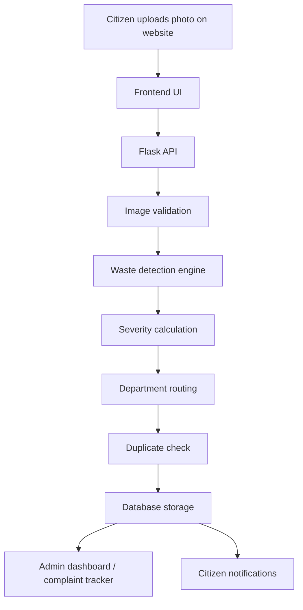

# EcoClean Civic — Project Documentation

## Overview

EcoClean Civic is an AI-powered municipal waste reporting system. Citizens can upload photos of illegal dumping, overflowing bins, or other waste issues. The system automatically detects waste items, computes severity, routes complaints to the appropriate department, and lets admins track, analyze, and resolve reports.

## Technical Architecture

EcoClean Civic is built as a simple three-layer application:

### 1. Frontend Layer

The frontend is a single-page web application that runs in the browser. It provides the screens for:

- reporting a waste issue
- viewing complaints and tracking status
- accessing the admin dashboard
- signing in or registering as a citizen or admin

It uses HTML, CSS, JavaScript, Leaflet maps, and Chart.js for visualization.

### 2. Backend Layer

The backend is a Flask application that handles all business logic and API requests. It is responsible for:

- validating uploads
- storing complaint data
- running the detection pipeline
- calculating severity
- routing complaints to departments
- checking duplicates
- managing authentication and authorization
- generating analytics output

### 3. Data Layer

The application stores structured data in a database and stores uploaded images in the local uploads folder.

- Default database: SQLite
- Docker database: PostgreSQL
- Image storage: local uploads folder

### Simple System Flow



### Easy-to-Understand Explanation

Think of the system as a smart waste reporting assistant:

- The website is the place where people report a problem.
- The backend is the brain that decides what to do with the report.
- The AI part looks at the photo and identifies the type of waste.
- The rules engine decides how serious the issue is.
- The system then sends the complaint to the correct department and stores it for tracking.

### Main Components and Their Roles

| Component | Role |
|---|---|
| Frontend | Lets users upload photos, view maps, and use the dashboard |
| Flask API | Receives requests, validates inputs, performs logic |
| Detection Module | Detects waste in uploaded images |
| Severity Engine | Calculates Low / Medium / High severity |
| Routing Module | Sends the complaint to the correct department |
| Database | Saves complaint records and user data |
| Analytics Module | Provides summary and geolocation insights |
| Notifications | Sends updates when complaint status changes |

## Project Goal

The project aims to help municipalities:

- receive waste complaints quickly from citizens
- reduce manual review effort using AI detection
- prioritize high-risk waste issues using severity scoring
- route reports to the right department automatically
- prevent duplicate municipal dispatches
- provide dashboards and analytics for admins

## Key Features

- AI waste detection with optional real YOLOv8 inference
- Mock detection mode for demo and local development
- Severity analysis based on coverage ratio and item count
- Department routing based on detected waste categories
- Duplicate complaint detection using geolocation
- Authentication and role-based access control
- Admin analytics and complaint tracking
- Citizen notification hooks for status changes
- Docker-ready deployment setup

## Tech Stack

### Frontend

- HTML
- CSS
- JavaScript
- Leaflet (interactive maps)
- Chart.js (analytics charts)

### Backend

- Python
- Flask
- Flask-SQLAlchemy
- Werkzeug
- Pillow
- Gunicorn

### AI / Detection

- YOLOv8 via ultralytics
- Optional mock detector fallback for environments without trained weights

### AI Model Used in This Project

This project is designed to train and use a custom YOLOv8 object detection model for waste detection.

- Model family: YOLOv8
- Training notebook: [train_waste_yolov8.ipynb](train_waste_yolov8.ipynb)
- Output model file: `best.pt`
- Runtime loading code: [backend/detection.py](backend/detection.py)
- Environment variable for real model: `WASTE_MODEL_WEIGHTS`

When the app starts, it checks whether `WASTE_MODEL_WEIGHTS` points to a valid model file. If yes, it loads the real YOLOv8 model. If not, it automatically switches to the mock detector so the app can still run for demos and development.

### Dataset Used for Training

The real model is trained on the TACO dataset, which stands for Trash Annotations in Context.

- Dataset source: public TACO dataset on Roboflow
- Training notebook: [train_waste_yolov8.ipynb](train_waste_yolov8.ipynb)
- Purpose: object detection of waste and litter in real-world environments

The notebook downloads the TACO dataset from Roboflow, then remaps the original 60 TACO categories into 9 EcoClean classes used by this project. Those remapped classes are the labels the trained YOLOv8 model learns to detect.

This means the project uses:

- TACO as the base dataset
- custom EcoClean label mapping for this application
- YOLOv8 for training and inference

### Database

- SQLite by default
- PostgreSQL in Docker deployment

### Testing

- Pytest

## Folder Structure

```text
waste-management-system/
├── backend/
│   ├── app.py
│   ├── config.py
│   ├── models.py
│   ├── detection.py
│   ├── severity.py
│   ├── routing.py
│   ├── notifications.py
│   ├── gunicorn.conf.py
│   ├── Dockerfile
│   ├── requirements.txt
│   ├── routes/
│   │   ├── analytics.py
│   │   ├── auth.py
│   │   └── complaints.py
│   ├── tests/
│   │   ├── conftest.py
│   │   ├── test_app.py
│   │   └── test_engine.py
│   ├── uploads/
│   └── waste_management.db
├── frontend/
│   ├── index.html
│   ├── css/
│   └── js/
├── docker-compose.yml
├── README.md
├── future_scope_roadmap.md
├── train_waste_yolov8.ipynb
└── PROJECT_DOCUMENTATION.md
```

## How the Application Works

### 1. Report Submission

Users open the frontend, go to the Report Waste section, upload an image, optionally select a location, and submit the complaint.

### 2. Image Validation

The backend validates the uploaded file to make sure it is a readable image and allowed format.

### 3. Detection

The detection module either:

- uses a trained YOLOv8 model if available, or
- uses a mock detector to simulate detections for demo/testing purposes.

### 4. Severity Calculation

The system analyzes detected items and image size to compute:

- item count
- coverage ratio
- severity level (Low / Medium / High)

### 5. Department Routing

Detected waste classes are mapped to the correct municipal department.

### 6. Duplicate Detection

The project checks whether the new complaint is within 50 meters of an existing unresolved complaint and marks it as a duplicate if needed.

### 7. Data Storage

Complaint details, detections, and metadata are stored in the database.

### 8. Admin Dashboard

Admins can:

- view all complaints
- filter by status, severity, and department
- review analytics
- update complaint status
- inspect geospatial data

### 9. Notification Flow

When complaint statuses change, the notification module can send updates to the citizen.

## Main Backend Modules

### app.py

- creates the Flask app
- loads configuration
- initializes the database
- seeds default admin and citizen users
- registers blueprints
- serves the frontend

### config.py

- stores configuration values such as:
  - database location
  - upload folder
  - secret key
  - allowed file types
  - model weight path

### models.py

Defines the database models:

- User
- Complaint
- DetectionItem

Also includes geospatial calculation helpers.

### detection.py

Handles image validation and detection logic.

This includes:

- image verification
- image size retrieval
- mock detection generation
- real YOLOv8 inference support

### severity.py

Computes complaint severity based on detections and image area.

### routing.py

Maps waste classes to suitable municipal departments.

### notifications.py

Contains logic for status notifications.

### routes/auth.py

Provides authentication APIs such as:

- register
- login
- logout
- current user lookup

### routes/complaints.py

Provides complaint APIs such as:

- upload complaint
- list complaints
- get complaint details
- update complaint status
- duplicate-check endpoint

### routes/analytics.py

Provides admin analytics endpoints such as:

- summary analytics
- geospatial analytics

## Main Frontend Files

### index.html

Contains the full UI structure:

- report tab
- track tab
- admin tab
- auth modal

### js/app.js

Handles:

- authentication UI
- map interactions
- file upload preview
- complaint submission
- complaint listing
- analytics rendering
- admin controls

### css/styles.css

Contains the complete styling for the web application.

## API Overview

### Auth Endpoints

- POST /api/auth/register
- POST /api/auth/login
- POST /api/auth/logout
- GET /api/auth/me

### Complaint Endpoints

- POST /api/complaints/upload
- POST /api/complaints/check-duplicate
- GET /api/complaints
- GET /api/complaints/<id>
- PATCH /api/complaints/<id>/status

### Analytics Endpoints

- GET /api/analytics/summary
- GET /api/analytics/geo

## Demo Accounts

| Role | Email | Password |
|---|---|---|
| Citizen | citizen@civic.gov | citizen123 |
| Admin | admin@civic.gov | admin123 |

## Local Setup

### Python environment

```bash
cd backend
pip install -r requirements.txt
python app.py
```

Then open:

```text
http://localhost:5050
```

### Running tests

```bash
cd backend
pytest tests
```

## Docker Setup

```bash
cp .env.example .env
docker-compose up --build
```

## Real YOLO Model Setup

By default, the app runs in mock mode. To use a real YOLOv8 model:

1. Open the notebook at the project root.
2. Train the model in Google Colab or another GPU environment.
3. Download the trained weights file.
4. Set the WASTE_MODEL_WEIGHTS environment variable.
5. Restart the app.

## Current Database Behavior

The app uses SQLite by default and automatically creates the required tables on first start. A migration helper also upgrades older SQLite databases when new complaint columns are added.

## Notes

- The app is designed to work locally without a trained YOLO model through mock detection.
- The frontend is served by Flask, so the backend and frontend are integrated in one app.
- The project is suitable as a prototype or demo municipal waste management system.

## Future Scope

The roadmap in [future_scope_roadmap.md](future_scope_roadmap.md) describes planned improvements such as:

- improved model training and real detection quality
- stronger analytics and reporting
- more complete notification and dispatch workflows
- broader municipal integration features

## Conclusion

EcoClean Civic is a full-stack civic waste management solution that combines web-based reporting, AI detection, severity scoring, routing logic, analytics, and admin oversight in a single project. It is designed to be easy to run locally, easy to demonstrate, and extensible for real municipal use.
